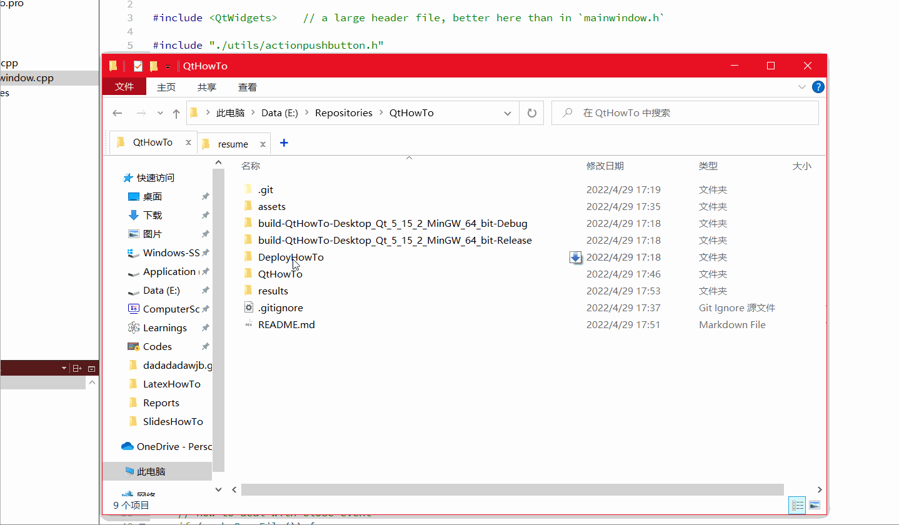
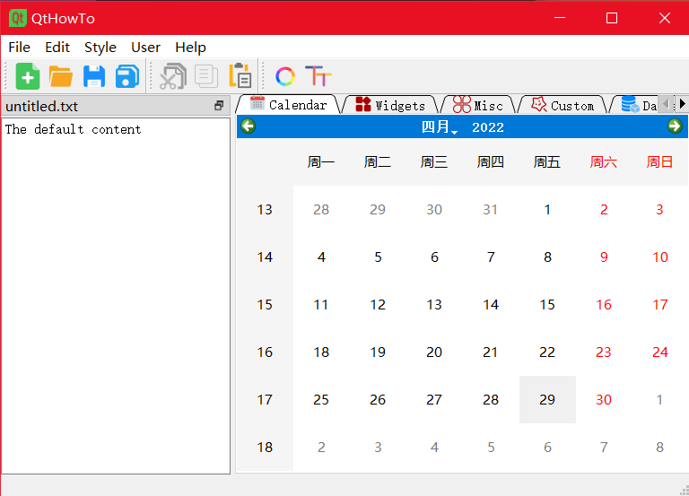

# QtHowTo
A systematic guidance and reference to Qt with clean and well-annotated main window application in C++.

## Support Features
* So many Qt own features, see directly the use result of `QtHowTo.exe`
* Detailed nodes on how to deploy Qt application
* Easy-to-manage images organization
* Some useful self-implemented widgets

## Get Started
The project is a ready-to-import Qt Creator project, directly open `./QtHowTo/` by Qt Creator in windows.

## Demo

## Results

